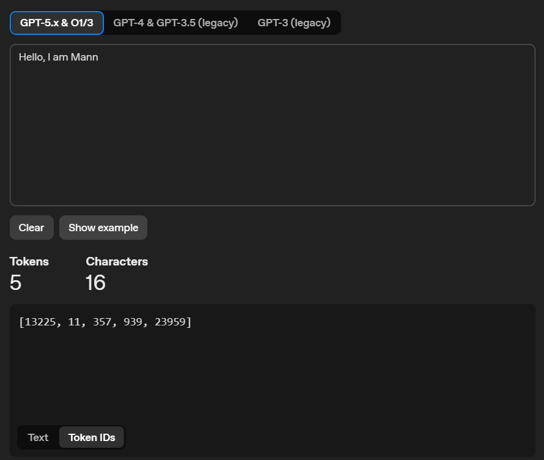

# Tokenization using `tiktoken`

Sabse pehle start karte hain **Tokenization** se, jo sabse important aur pehla step hai to understand how LLM works, or in short, how your ChatGPT works.

## What is `tiktoken`?

`tiktoken` ek package hai jo OpenAI ne create kiya hai.

Iska use hum text ko tokens mein convert karne ke liye karte hain. LLMs directly normal text ko read nahi karte, wo text ko small parts mein todte hain jinko **tokens** bolte hain.

## Firstly, what is Tokenization?

Tokenization turns text into small pieces called **tokens**.

Models read those tokens to understand the text and predict what comes next.

For example:

```text
Hello, I am Mann
```

Ye sentence tokenization ke baad kuch numbers ke form mein convert ho jata hai, because model text ko numbers/tokens ke form mein process karta hai.

## Step 1: Import `tiktoken`

Sabse pehle hum `tiktoken` package import karenge.

```python
import tiktoken
```

## Step 2: Create Encoder

Ab hum encoder create karenge using model name.

```python
encoder = tiktoken.encoding_for_model("gpt-4o")
```

Yahan model koi bhi le sakte ho aap. Maybe latest model try karo and see if that works.

Encoder ka kaam hota hai text ko tokens mein convert karna.

## Step 3: Encode the Text

Ab hum ek normal sentence lenge.

```python
text = "Hello, I am Mann"
```

Yahan maine ek sentence liya hai. Aap apni choice ka koi bhi sentence use kar sakte ho.

Now we will encode this text:

```python
tokens = encoder.encode(text)
print("Tokens:", tokens)
```

Jab aap text ko encode karte ho, basically aap OpenAI ya LLM ko bol rahe ho ki is text ko tokens mein convert karo.

Phir model ke hisaab se jo bhi tokens ban rahe honge, wo aapko array format mein output de dega.

Output:

```text
Tokens: [13225, 11, 357, 939, 23959]
```

## Step 4: Decode Tokens Back to Text

Agar aapko verify karna hai ki tokens sahi hain ya nahi, to aap tokens ko wapas normal text mein decode kar sakte ho.

```python
tokens = [13225, 11, 357, 939, 23959]

decoded = encoder.decode(tokens)
print("Decoded normal text is:", decoded)
```

Output:

```text
Decoded normal text is: Hello, I am Mann
```

Iska matlab ye tokens same text ko represent kar rahe hain.

## Verify Tokens Online

Agar aapko ye verify karna hai ki ye tokens sahi hain ya nahi, to aap [OpenAI Tokenizer](https://platform.openai.com/tokenizer?view=bpe) par jaake same text try karke dekh sakte ho.

Wahan same text paste karo:

```text
Hello, I am Mann
```

Phir aapko tokens output dikh jayega. Isse aap check kar sakte ho ki jo tokens hamare code se aaye hain, wo same hain ya nahi.

## Full Code

```python
import tiktoken

encoder = tiktoken.encoding_for_model("gpt-4o")

text = "Hello, I am Mann"

tokens = encoder.encode(text)
print("Tokens:", tokens)

tokens = [13225, 11, 357, 939, 23959]

decoded = encoder.decode(tokens)
print("Decoded normal text is:", decoded)
```

## Output Screenshot



## Conclusion

So basically, tokenization ek process hai jisme normal text ko small tokens mein convert kiya jata hai.

LLMs like ChatGPT text ko directly samajhne ke bajay tokens ke through process karte hain. Isliye tokenization is the first and very important step to understand how LLMs work.
